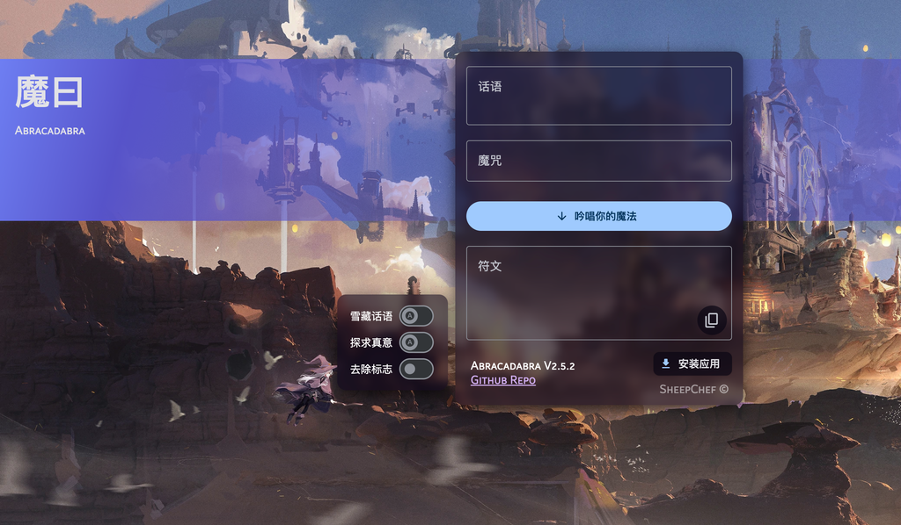

# 镜像发布

构建镜像并发布至 Docker Hub、GitHub Container Registry 和阿里云镜像服务。

阿里云镜像地址：`registry.cn-beijing.aliyuncs.com`  
GitHub Container Registry 地址：`ghcr.io`

## 镜像

每个镜像含 `latest` 和 `nightly` 标签（如有）。其他版本请参见 Docker Hub 或 GitHub Container Registry 页面。

现有镜像如下：

- `funnyzak/y-webrtc-signaling:latest`: y-webrtc-signaling 信令服务器镜像 ([Hub](https://hub.docker.com/r/funnyzak/y-webrtc-signaling))。
- `funnyzak/abracadabra-web:latest`: Abracadabra_demo 魔曰 Demo 镜像 ([Hub](https://hub.docker.com/r/funnyzak/abracadabra-web))。
- `funnyzak/libreoffice-server:latest`: LibreOffice-Server 镜像 ([Hub](https://hub.docker.com/r/funnyzak/libreoffice-server))。
- `funnyzak/request-hub:latest`: Request-Hub 镜像 ([Hub](https://hub.docker.com/r/funnyzak/request-hub))。
- `funnyzak/canal-adapter:latest`: Canal-Adaptor 镜像 ([Hub](https://hub.docker.com/r/funnyzak/canal-adapter))。
- `funnyzak/canal-deployer:latest`: Canal-Deployer 镜像 ([Hub](https://hub.docker.com/r/funnyzak/canal-deployer))。
- `funnyzak/canal-admin:latest`: Canal-Admin 镜像 ([Hub](https://hub.docker.com/r/funnyzak/canal-admin))。

## 服务

Docker 镜像构建目录位于 ./Docker。也可下载该目录自行构建镜像。

- `./Docker/y-webrtc-signaling`: 构建 [y-webrtc-signaling](https://github.com/lobehub/y-webrtc-signaling) 服务镜像。
- `./Docker/abracadabra-web`: 构建 [Abracadabra_demo](https://github.com/SheepChef/Abracadabra_demo) 服务镜像。
- `./Docker/libreoffice-server`: 构建 [LibreOffice-Server](https://github.com/funnyzak/libreoffice-server) 服务镜像。
- `./Docker/request-hub`: 构建 [Request-Hub](https://github.com/kyledayton/requesthub) 服务镜像。
- `./Docker/canal`: 构建 [Alibaba Canal](https://github.com/alibaba/canal) 服务镜像。

## 使用

### y-webrtc-signaling

[](https://hub.docker.com/r/funnyzak/y-webrtc-signaling/tags)


拉取镜像：
<details>
  
```bash
docker pull funnyzak/y-webrtc-signaling:latest
# GitHub 
docker pull ghcr.io/funnyzak/y-webrtc-signaling:latest
# Aliyun
docker pull registry.cn-beijing.aliyuncs.com/funnyzak/y-webrtc-signaling:latest
```
</details>

部署示例：
<details>
  
Docker 部署示例：
```bash
docker run -d --name y-webrtc-signaling -p 4444:4444 funnyzak/y-webrtc-signaling:latest
```

Docker Compose 部署示例：
```yaml
version: '3.1'
services:
  y-webrtc-signaling:
    container_name: y-webrtc-signaling
    image: funnyzak/y-webrtc-signaling:latest
    restart: always
    network_mode: bridge
    ports:
      - "4444:4444"
```
</details>


更多信息请查看 [y-webrtc-signaling](./Docker/y-webrtc-signaling/README.md)。

---

### 魔曰 Demo

[](https://hub.docker.com/r/funnyzak/abracadabra-web/tags)


拉取镜像：
<details>

```bash
docker pull funnyzak/abracadabra-web:latest
# GitHub
docker pull ghcr.io/funnyzak/abracadabra-web:latest
# Aliyun
docker pull registry.cn-beijing.aliyuncs.com/funnyzak/abracadabra-web:latest
```

</details>

部署示例：
<details>

Docker 部署示例：
```bash
docker run -d --name abracadabra-web -p 8080:80 funnyzak/abracadabra-web:latest
```

Docker Compose 部署示例：
```yaml
version: '3.1'

services:
  abracadabra-web:
    container_name: abracadabra-web
    image: funnyzak/abracadabra-web:latest
    restart: always
    network_mode: bridge
    ports:
      - "8080:80"
```

启动后，如下图：



</details>

更多信息请查看 [Abracadabra_demo](Docker/abracadabra-web/README.md)。

---

### LibreOffice-Server

[](https://hub.docker.com/r/funnyzak/libreoffice-server/tags)


拉取镜像：
<details>

```bash
docker pull funnyzak/libreoffice-server:latest
# GitHub
docker pull ghcr.io/funnyzak/libreoffice-server:latest
# Aliyun
docker pull registry.cn-beijing.aliyuncs.com/funnyzak/libreoffice-server:latest
```

</details>

部署示例：

<details>

Docker 部署示例：
```bash
docker run -d --name libreoffice -p 3000:3000 -p 3001:8038 funnyzak/libreoffice-server:latest
```

Docker Compose 部署示例：
```yaml

version: "3.1"
services:
  libreoffice:
    image: funnyzak/libreoffice-server
    container_name: libreoffice
    environment:
      - PUID=1000
      - PGID=1000
      - TZ=Asia/Shanghai
    # volumes:
    #   - ./media/fonts:/usr/share/fonts/custom # 自定义字体
    ports:
      - 3000:3000 # libreoffice web editor
      - 3001:8038 # web api
    restart: unless-stopped
```

</details>

更多信息请查看 [LibreOffice-Server](Docker/libreoffice-server/README.md)。

---

### Request-Hub

[](https://hub.docker.com/r/funnyzak/request-hub/tags)


 [RequestHub](https://github.com/kyledayton/requesthub) 用以接收、记录和代理HTTP请求。 该镜像支持 `linux/386`, `linux/amd64`, `linux/arm/v6`, `linux/arm/v7`, `linux/arm64/v8`, `linux/s390x`。

拉取镜像：
<details>

```bash
docker pull funnyzak/request-hub:latest
# GitHub
docker pull ghcr.io/funnyzak/request-hub:latest
# Aliyun
docker pull registry.cn-beijing.aliyuncs.com/funnyzak/request-hub:latest
```

</details>

部署示例：

<details>

Docker 部署示例：
```bash
docker run -d --name request-hub -p 8080:8080 funnyzak/request-hub:latest
```

Docker Compose 部署示例：
```yaml
version: '3.1'
services:
  requesthub:
    image: funnyzak/request-hub
    container_name: requesthub
    restart: always
    environment:
        - TZ=Asia/Shanghai
        - LANG=C.UTF-8
        - CONFIG_YML=/config.yml
        - NO_WEB=false
        - PORT=54321
        - MAX_REQUESTS=1024
        - USER_NAME=hello
        - PASSWORD=world
    volumes:
      - ./config.yml:/config.yml
    ports:
      - 80:54321
```

部署后，如下图：


</details>

更多信息请查看 [Request-Hub](Docker/request-hub/README.md)。

---

### Canal

Canal 是阿里巴巴 MySQL 数据库 binlog 增量订阅&消费组件。

当前提供三个镜像：

[](https://hub.docker.com/r/funnyzak/canal-adapter/tags)
[](https://hub.docker.com/r/funnyzak/canal-deployer/tags)
[](https://hub.docker.com/r/funnyzak/canal-admin/tags)

[](https://hub.docker.com/r/funnyzak/canal-adapter)
[](https://hub.docker.com/r/funnyzak/canal-deployer)
[](https://hub.docker.com/r/funnyzak/canal-admin)

[](https://hub.docker.com/r/funnyzak/canal-adapter/tags)
[](https://hub.docker.com/r/funnyzak/canal-deployer/tags)
[](https://hub.docker.com/r/funnyzak/canal-admin/tags)

拉取镜像：

<details>

```bash
docker pull funnyzak/canal-adapter:latest
docker pull funnyzak/canal-deployer:latest
docker pull funnyzak/canal-admin:latest
# GitHub
docker pull ghcr.io/funnyzak/canal-adapter:latest
docker pull ghcr.io/funnyzak/canal-deployer:latest
docker pull ghcr.io/funnyzak/canal-admin:latest
# Aliyun
docker pull registry.cn-beijing.aliyuncs.com/funnyzak/canal-adapter:latest
docker pull registry.cn-beijing.aliyuncs.com/funnyzak/canal-deployer:latest
docker pull registry.cn-beijing.aliyuncs.com/funnyzak/canal-admin:latest
```

</details>

更多信息请参考 [Canal 官方仓库](https://github.com/alibaba/canal/releases)。

## 贡献

欢迎贡献更多的 Docker 镜像构建目录。
